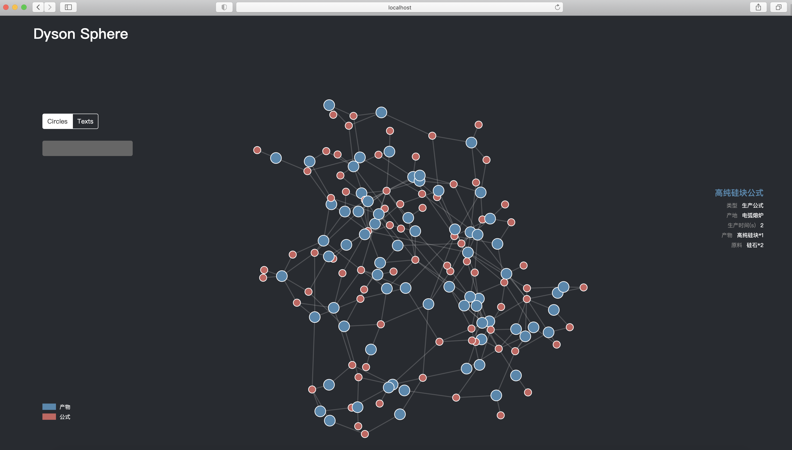
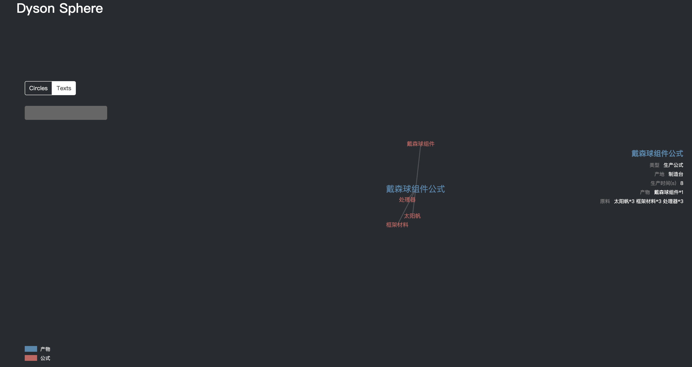

## 戴森球图谱
<p align="left">
    <a href="https://github.com/xchen034/dyson_sphere/master/LICENSE">
    </a>
</p>

#### 内容
- 戴森球图谱可视化: dyson_visualization
- 戴森球建造公式检索: dyson_search
- 戴森球建造公式社区发现: modularity

#### 戴森球图谱可视化
- 可视化代码引用自 https://github.com/Honlan/starwar-visualization
- 实例文件位于dyson_visualization目录中
- 需安装nginx解决跨域访问
##### 运行示例1：
<p align="center">
    <br>
    
    <br>
</p>

##### 运行示例2：
<p align="center">
    <br>
    
    
    <br>
</p>

#### 戴森球建造公式检索
- 实现功能：输入不同数量的目标产物，生成对应的生产方案，存入excel
- 示例结果：test_excel.xlsx
    ##### 运行说明
    执行文件：dyson_search/main.py
    ```
    python main.py configs/test_config.json
    ```
    ##### config文件说明
    > - products_info: Dict, 目标产物及其数量
    > - dyson_file_path: 戴森球图谱文件路径
    > - extra_resources: 可选原料，如硫酸，刺笋结晶等；设置后生产公式会选择高效公式 
    > - save_excel_path: 输出的excel路径

#### 戴森球建造公式社区发现
- 社区发现算法: Louvain
- 社区发现示例结果（人工微调）：community_results.xlsx
- 实现功能：通过原料对生产公式进行社区发现，将原料相近的生产公式放在同一社区，方便物流塔规划
    ##### 运行说明
    执行文件: modularity/main.py
    ```
    python main.py settings/modularity_dyson_sphere.yaml
    ```
